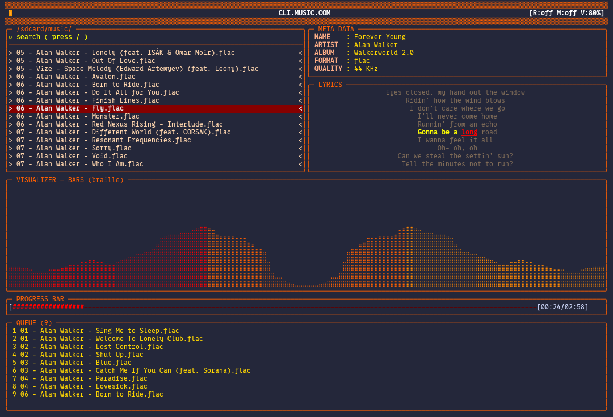

<div align="center">

```
 ██████╗██╗     ██╗    ███╗   ███╗██╗   ██╗███████╗██╗ ██████╗    ██████╗ ██████╗ ███╗   ███╗
██╔════╝██║     ██║    ████╗ ████║██║   ██║██╔════╝██║██╔════╝   ██╔════╝██╔═══██╗████╗ ████║
██║     ██║     ██║    ██╔████╔██║██║   ██║███████╗██║██║        ██║     ██║   ██║██╔████╔██║
██║     ██║     ██║    ██║╚██╔╝██║██║   ██║╚════██║██║██║        ██║     ██║   ██║██║╚██╔╝██║
╚██████╗███████╗██║    ██║ ╚═╝ ██║╚██████╔╝███████║██║╚██████╗   ╚██████╗╚██████╔╝██║ ╚═╝ ██║
 ╚═════╝╚══════╝╚═╝    ╚═╝     ╚═╝ ╚═════╝ ╚══════╝╚═╝ ╚═════╝    ╚═════╝ ╚═════╝╚═╝     ╚═╝
```

**A terminal-native music player with a fully declarative UI, built for Termux and Linux.**

[](https://en.cppreference.com/w/cpp/20)
[](https://invisible-island.net/ncurses/)
[](https://ffmpeg.org/)
[](https://developer.android.com/ndk/guides/audio/opensl)
[](./LICENSE)

</div>

---

## Table of Contents

- [Overview](#overview)
- [Features](#features)
- [Screenshots](#screenshots)
- [Architecture](#architecture)
- [Installation](#installation)
  - [Termux (Android)](#termux-android)
  - [Linux Desktop](#linux-desktop)
- [Building](#building)
- [Configuration](#configuration)
  - [Declarative Layout DSL](#declarative-layout-dsl)
  - [Layout Modifiers](#layout-modifiers)
  - [Direction Blocks](#direction-blocks)
  - [Font Map](#font-map)
  - [Hotkey Map](#hotkey-map)
  - [Color Scheme](#color-scheme)
  - [Border Characters](#border-characters)
- [Panels Reference](#panels-reference)
- [Keybindings](#keybindings)
- [Lyrics Engine](#lyrics-engine)
- [Visualizer](#visualizer)
- [Vocal Visualizer](#vocal-visualizer)
- [Queue System](#queue-system)
- [Settings Overlay](#settings-overlay)
- [File Structure](#file-structure)
- [Technical Notes](#technical-notes)

---

## Overview

**CLI.MUSIC.COM** is a terminal music player written in C++20. It runs inside a single ncurses session and renders every panel — metadata, cover art, synced lyrics, two visualizers, a play queue, and a playlist — entirely in the terminal using Unicode braille characters and UTF-8 box drawing.

The UI is **fully declarative**: the layout is defined as a DSL string inside `config.txt`, identical in spirit to Termux's extra keys system. Any panel can be placed, resized, merged, or excluded entirely. Backends for excluded panels are disabled at startup so there is zero overhead for features you do not use.

---

## Features

| Category | Details |
|---|---|
| **Audio** | FFmpeg decoder — FLAC, MP3, M4A, OPUS, OGG, WAV, AAC, WebM, WMA, APE, MKA, ALAC, AIFF, TTA |
| **Output** | OpenSL ES on Android / Termux; stub on desktop |
| **UI** | Fully declarative ncurses TUI — layout defined in `config.txt` |
| **Visualizer** | 32-band log-spaced FFT · BARS (braille bar chart + peak hold) · SCOPE (oscilloscope) |
| **Vocal Viz** | 21-column stereo cross-correlation — maps inter-channel delay to spatial position |
| **Lyrics** | Enhanced LRC parser (word-level sync) · async `syncedlyrics` fetch · sidecar `.lrc/.txt/.lyrics` |
| **Queue** | Persistent play queue drains before playlist auto-advance |
| **Playlist** | Recursive directory scanner · folder filter · shuffle (Fisher-Yates) · repeat · loop |
| **Settings** | 6-tab in-app overlay (~75% control) + `config.txt` (100% control) |
| **Theming** | 6 built-in themes · full ANSI-256 color · custom border characters · per-character font map |
| **Hotkeys** | Every key fully remappable in `config.txt` |
| **Platform** | Termux (Android), Linux; C++20, CMake ≥ 3.16 |

---

## Screenshots

> Running on Termux — 21-slot vocal visualizer, BARS visualizer, synced word-level lyrics.



## Architecture

```
┌────────────────────────────────────────────────────────────────────────┐
│                         CLI.MUSIC.COM                                  │
│                                                                        │
│  ┌──────────────┐    ┌─────────────┐    ┌──────────────────────────┐   │
│  │ config.txt   │───▶│ConfigParser │───▶│        Settings          │   │
│  │ (100% ctrl)  │    │  (overlay)  │    │ colors · keys · layout   │   │
│  └──────────────┘    └─────────────┘    │ font_map · border_chars  │   │
│                                         └────────────┬─────────────┘   │
│  ┌──────────────┐                                    │                 │
│  │settings.conf │──────────────────────────────────▶ │ (merged)        │
│  │ (~75% ctrl)  │                                    │                 │
│  └──────────────┘                                    ▼                 │
│                                         ┌──────────────────────────┐   │
│  ┌──────────────┐    ┌──────────────┐   │      LayoutEngine        │   │
│  │  AvDecoder   │    │ AudioEngine  │   │  parse_layout()          │   │
│  │  (FFmpeg)    │───▶│ (OpenSL ES)  │   │  compute_layout()        │   │
│  └──────┬───────┘    └──────┬───────┘   │  PanelRect[]             │   │
│         │                  │            └────────────┬─────────────┘   │
│         ▼                  ▼                         ▼                 │
│  ┌──────────────────────────────┐    ┌──────────────────────────────┐  │
│  │           Player             │    │       LayoutWindows          │  │
│  │  playlist · queue · meta     │───▶│  WINDOW* per PanelRect       │  │
│  │  seek · vol · speed          │    │  auto desktop / mobile mode  │  │
│  └──────┬────────┬──────────────┘    └──────────────┬───────────────┘  │
│         │        │                                  │                  │
│    ┌────▼──┐ ┌───▼──────┐           ┌───────────────▼──────────────┐   │
│    │Visuali│ │VocalViz  │           │          Draw Dispatch       │   │
│    │BARS   │ │21-slot   │           │  META · COVER · LYRICS       │   │
│    │SCOPE  │ │xcorr     │           │  VOCAL-VIZ · VIZ · PROGRESS  │   │
│    └───────┘ └──────────┘           │  LIST · QUEUE · HELP         │   │
│                                     └──────────────────────────────┘   │
│         ┌──────────────┐                                               │
│         │  Lyrics      │                                               │
│         │  LRC parser  │                                               │
│         │  async fetch │                                               │
│         └──────────────┘                                               │
└────────────────────────────────────────────────────────────────────────┘
```

### Component summary

| File | Role |
|---|---|
| `main.cpp` | Event loop, draw dispatch, input routing, auto-advance logic |
| `player.h/cpp` | Playback control — wraps AvDecoder + AudioEngine + Queue |
| `av_decoder.h/cpp` | FFmpeg demux/decode pipeline, metadata extraction, seek |
| `audio_engine.h/cpp` | OpenSL ES output (Android) / stub (desktop), volume, speed |
| `visualizer.h/cpp` | 32-band FFT, cosine-interpolated braille renderer |
| `vocal_viz.h` | Windowed normalised cross-correlation, spatial energy mapping |
| `lyrics.h` | Enhanced LRC parser, async `syncedlyrics` fetch, word-sync |
| `playlist.h/cpp` | Recursive scanner, folder filter, shuffle, sort |
| `queue.h` | Deque-backed play queue, drains before playlist advance |
| `ui_layout.h` | Declarative layout DSL parser and geometry engine |
| `settings.h` | Color scheme, font map, keybinds, border chars, layout storage |
| `config_parser.h` | Parses `config.txt`, overlays onto runtime settings |
| `cover_art.h` | ASCII pattern placeholder (embed art extension point) |
| `kissfft/` | Vendored single-header FFT (no external dependency) |

---

## Installation

### Termux (Android)

```bash
# 1. Update Termux packages
pkg update && pkg upgrade -y

# 2. Install all dependencies
pkg install -y \
    cmake clang git \
    ncurses ncurses-dev \
    ffmpeg libffmpeg-dev \
    python python-pip

# 3. Install syncedlyrics (optional — enables online lyrics fetch)
pip install syncedlyrics

# 3b. Install streaming support (optional — enables yt: search + playback)
#     mpv is preferred (full play/pause/seek/volume control); ffplay is a
#     fallback with play/stop only. yt-dlp powers both search and download.
pkg install -y mpv yt-dlp
# or, if mpv isn't available: pkg install -y ffmpeg yt-dlp   (ffmpeg ships ffplay)

# 4. Clone and build
git clone https://github.com/itzender5820/climusic.git
cd climusic
cmake -B build -DCMAKE_BUILD_TYPE=Release
cmake --build build -j$(nproc)
```

> **Storage permission** — Termux needs access to `/sdcard/music/` to scan your library:
> ```bash
> termux-setup-storage
> ```
> Then open Android Settings → Apps → Termux → Permissions → Files and media → Allow.

### Linux Desktop

```bash
# Ubuntu / Debian
sudo apt install cmake g++ libncurses-dev libavformat-dev \
                 libavcodec-dev libavutil-dev libswresample-dev

# Arch Linux
sudo pacman -S cmake gcc ncurses ffmpeg

# Streaming support (optional): mpv (preferred) or ffplay, plus yt-dlp
sudo apt install mpv                # or: sudo apt install ffmpeg (for ffplay)
pip install yt-dlp                  # or: sudo apt install yt-dlp

# Build (audio is stubbed on non-Android — silent playback, visualizer still works)
git clone https://github.com/yourname/climusic.git
cd climusic
cmake -B build
cmake --build build -j$(nproc)
```

---

## Building

```bash
cd climusic
cmake -B build -DCMAKE_BUILD_TYPE=Release
cmake --build build -j$(nproc)

# Install to $PREFIX/bin (optional)
cmake --install build

# Run
./build/musico_verse
```

The binary searches for music in `/sdcard/music/` by default (configurable in `playlist.h`).

> **Rebuild from scratch after replacing source files:**
> ```bash
> rm -rf build && cmake -B build && cmake --build build -j$(nproc)
> ```

---

## Configuration

CLI.MUSIC.COM has two layers of configuration:

| Layer | File | Control |
|---|---|---|
| **Full control** | `~/.config/climusic/config.txt` | 100% — layout, font, hotkeys, colors, borders |
| **Runtime overlay** | `~/.config/climusic/settings.conf` | ~75% — colors, viz, theme (edited via the `S` key in-app) |

`config.txt` is loaded at startup and overlaid on top of `settings.conf`. Any key set in `config.txt` wins.

**Config file search order:**
1. `~/.config/climusic/config.txt`
2. `./config.txt` (current working directory)
3. `../config.txt` (one level above, useful when running from `build/`)

---

### Declarative Layout DSL

The layout is defined by two strings in `config.txt` — one for desktop mode (terminal width ≥ 120 columns) and one for mobile. The syntax is identical to Termux's extra-keys system.

```
DESK_MODE={
  [LIST][METADATA][ICON][LYRICS],\
  [UP][VOCAL-VIZ],\
  [UP][VIZ],\
  [PROGRESS-BAR],\
  [QUEUE],\
};
```

**Syntax rules:**

| Token | Meaning |
|---|---|
| `[BLOCK]` | Place a panel |
| `[]` | Empty spacer cell |
| `,\` | Row separator (start a new row) |
| `[BLOCK {side, ±w, h}]` | Place a panel with size modifiers |

**Available panels:**

| Name | Description |
|---|---|
| `META` or `METADATA` | Track metadata (title, artist, album, format, quality, year) |
| `COVER` or `ICON` | Cover art placeholder |
| `LYRICS` | Synced lyrics with word-level highlight |
| `VOCAL-VIZ` | 21-column stereo spatial visualizer |
| `VIZ` or `VISUALIZER` | Main frequency / oscilloscope visualizer |
| `PROGRESS-BAR` | Playback progress bar with timestamps |
| `LIST` or `PLAYLIST` | Scrollable playlist with inline search |
| `QUEUE` | Play queue panel |
| `HELP` or `CONTROLS` | Keybinding reference |

> **Exclusion:** any panel not listed in the layout is completely disabled — its draw function is never called and its backend runs at zero cost.

---

### Layout Modifiers

A cell can carry optional modifiers: `[BLOCK_NAME {side, ±width_delta, height}]`

```
[VOCAL-VIZ {right, +7, 8}]
```

| Modifier | Type | Effect |
|---|---|---|
| `side` | `left \| right \| top \| bottom` | Informational label (used by the parser for documentation) |
| `±width_delta` | Integer | Extra or fewer terminal columns for this cell. Stolen from / given to the right neighbour. |
| `height` | Positive integer | Absolute row height in lines. The `±` sign prefix is silently stripped — only the magnitude is used. |

**Column sizing rule:** each row divides the terminal width equally among all its cells (including direction/empty cells), then applies `width_delta` adjustments. Rows are independent — a 3-cell row and a 2-cell row each get their own equal split rather than aligning to a shared grid.

---

### Direction Blocks

Direction blocks let you extend an adjacent panel into an otherwise empty cell, creating non-rectangular layouts without hard-coding pixel coordinates.

| Block | Behaviour |
|---|---|
| `[LEFT]` | The block immediately to the **left** in the same row expands rightward to fill this cell |
| `[RIGHT]` | The block immediately to the **right** expands leftward |
| `[UP]` | Whichever block in the **previous row** overlaps this cell's X-midpoint expands downward |
| `[DOWN]` | Same as UP but looks at the **next row** |

**Example — LYRICS extends down into the vocal-viz row:**

```
MOBILE_MODE={
  [METADATA][ICON][LYRICS],\    ← row 0: 3 equal columns
  [VOCAL-VIZ][LEFT][UP],\       ← col 0: VOCAL-VIZ
                                   col 1: LEFT  → VOCAL-VIZ expands right (2/3 width)
                                   col 2: UP    → LYRICS expands down (1/3 width)
  [PROGRESS-BAR],\
  [VIZ],\
};
```

Results in:

```
┌──────────┬──────────┬──────────────┐
│ METADATA │   ICON   │              │
├──────────┴──────────┤    LYRICS    │
│     VOCAL-VIZ       │              │
├─────────────────────┴──────────────┤
│           PROGRESS-BAR             │
├────────────────────────────────────┤
│                VIZ                 │
└────────────────────────────────────┘
```

---

### Font Map

Every label rendered in the player goes through the font map before display. Map any ASCII character to any Unicode string:

```ini
font_en={
  A={𝓐,𝓪},    ## uppercase A → 𝓐,  lowercase a → 𝓪
  B={𝓑,𝓫},
  C={𝓒,𝓬},
  ## ...
};
```

The format is `LETTER={ uppercase_replacement, lowercase_replacement }`.

**Unicode glyph sources:**
- Full unicode catalogue: https://www.compart.com/en/unicode/category/So
- Quick font preview: https://tools.picsart.com/text/font-generator/

To revert a letter to plain ASCII just set both values to the original character:
```ini
A={A,a},
```

---

### Hotkey Map

Every action is remappable. Accepted key string formats:

| Format | Example | Matches |
|---|---|---|
| Single character | `"S"` | The `s` or `S` key |
| Named special key | `"ARROW_KEY_UP"` | ncurses `KEY_UP` |
| Unicode glyph | `"→"` | ncurses `KEY_RIGHT` |
| Keyword | `"ENTER"`, `"TAB"`, `"SPACE"`, `"ESC"`, `"BACKSPACE"` | Respective ncurses codes |

```ini
HKEY_SETTING="S"
HKEY_NAVIGATE_UP="ARROW_KEY_UP"
HKEY_NAVIGATE_DOWN="ARROW_KEY_DOWN"
HKEY_PRESS_TO_PLAY="ENTER"
HKEY_PRESS_TO_SEARCH="/"
HKEY_PRESS_TO_PLAY_NEXT_SONG="N"
HKEY_PRESS_TO_PLAY_PREVIOUS_SONG="B"
HKEY_PRESS_TO_SEEK_FORWARD="ARROW_KEY_RIGHT"
HKEY_PRESS_TO_SEEK_BACKWARD="ARROW_KEY_LEFT"
HKEY_PRESS_TO_INCRESE_VOLUME="1"
HKEY_PRESS_TO_DECRESE_VOLUME="2"
HKEY_PRESS_TO_ADD_HOVERING_SONG_TO_QUEUE="A"
HKEY_PRESS_TO_REMOVE_HOVERING_SONG_FROK_QUEUE="D"
HKEY_PRESS_TO_SWITCH_BETWEEN_CARDS="TAB"
KHEY_PRESS_TO_TOGGLE_REPEAT="R"
HKEY_PRESS_TO_TOGGLE_PLAY_PAUSE="P"
HKEY_PRESS_TO_TOGGLE_SHUFFLE="M"
HKEY_PRESS_TO_FILTER_FOR_FOLDER="F"
HKEY_PRESS_TO_CLEAR_FILTER="C"
HKEY_PRESS_TO_QUIT="Q"
HKEY_PRESS_TO_RESET_PREFRENCE="E"
```

---

### Color Scheme

Colors are specified as `ANSI_256_index,brightness_percent`:

```ini
border=39,100       ## cyan border at full brightness
viz_left=196,100    ## red left-zone bars
progress=82,100     ## green progress fill
lyr_hi=226,100      ## yellow active lyric line
```

**ANSI 256 color reference:** https://hexdocs.pm/color_palette/ansi_color_codes.html

All configurable color keys:

```ini
border          title           meta_key        meta_val
progress        progress_bg     status          playlist
pl_active_fg    pl_active_bg    viz             viz_left
viz_center      viz_right       viz_peak        lyr_dim
lyr_hi          lyr_word        noise           queue_item
queue_active
```

---

### Border Characters

Replace the default rounded box-drawing glyphs with any Unicode characters:

```ini
upper_left_corner="╭";    ## default rounded corners
upper_right_corner="╮";
bottom_left_corner="╰";
lower_right_corner="╯";
horizontal="─";
vertical="│";
```

**Box-drawing character reference:** https://www.compart.com/en/unicode/block/U+2500

Examples of alternative styles:

```ini
## Sharp corners
upper_left_corner="┌"; upper_right_corner="┐";
bottom_left_corner="└"; lower_right_corner="┘";

## Double-line
upper_left_corner="╔"; upper_right_corner="╗";
bottom_left_corner="╚"; lower_right_corner="╝";
horizontal="═"; vertical="║";

## ASCII fallback
upper_left_corner="+"; upper_right_corner="+";
bottom_left_corner="+"; lower_right_corner="+";
horizontal="-"; vertical="|";
```

---

## Panels Reference

### `META` — Metadata

Displays seven fields extracted from the audio file's embedded tags via FFmpeg:

```
NAME    : Track Title
ARTIST  : Artist Name
ALBUM   : Album Name
FORMAT  : flac
QUALITY : 44 KHz
YEAR    : 2025
```

### `LYRICS` — Synced Lyrics

The lyrics engine operates in three modes:

1. **Word-level sync** (Enhanced LRC `<mm:ss.xx>` tokens) — individual words are highlighted and underlined as the song progresses. Already-spoken words are shown in a different color from upcoming ones.
2. **Line-level sync** (standard LRC `[mm:ss.xx]` lines) — the active line is highlighted; the view is always centred on it with blank padding at song edges.
3. **No lyrics** — the panel fills with an animated braille noise field, with the fetch status overlaid in the centre.

**Lyrics lookup order:**
1. Sidecar file: `<audio>.lrc`, `<audio>.txt`, `<audio>.lyrics`
2. Async fetch via `syncedlyrics` (Python) — cached as `.lrc` next to the audio file

### `VOCAL-VIZ` — Stereo Spatial Visualizer

Uses **windowed normalised cross-correlation** between the left and right audio channels to determine where in the stereo field each component lives. Maps inter-channel delay to 21 spatial columns:

```
← L leads (panned-left content)    │ C │    R leads (panned-right content) →
80ms 60ms 40ms 20ms 10ms 5ms 4ms 3ms 2ms 1ms 0ms 1ms 2ms 3ms 4ms 5ms 10ms 20ms 40ms 60ms 80ms
```

- **Column 10 (lag = 0ms):** energy from L and R in phase → primarily centre content (vocals, kick drum)
- **Columns < 10:** L channel leads R → panned-left instruments
- **Columns > 10:** R channel leads L → panned-right instruments
- **Wide spread:** highly stereo-processed reverbs, wide synths

The correlation window is 4096 samples (~93ms at 44.1kHz), covering all 80ms extreme delays with margin.

### `VIZ` — Frequency / Oscilloscope Visualizer

Two render styles (set `viz_style` in config):

**`0` — BARS (braille bar chart)**

- 32-band log-spaced FFT over a 2048-sample Hann-windowed frame
- Frequency edges fixed at: 30 → 50 → 80 → 120 → 180 → 250 → 350 → 500 → 700 → 1k → 1.4k → 2k → 2.8k → 4k → 5.6k → 8k → 12kHz
- Symmetric mirror: 16 half-bands reflected to produce 32 display bands centred on bass
- Cosine interpolation between bands — eliminates the staircase artefact
- Optional peak-hold dots with configurable decay speed
- Color zones: bass (left) / mid / treble (right) each in separate colors

**`1` — SCOPE (oscilloscope)**

- Plots raw PCM waveform from a 4096-sample ring buffer
- Vertical gap between consecutive samples is filled with a connecting line, producing a continuous trace
- One braille sub-cell row per 4 amplitude levels → smooth sub-character resolution

**Tunable parameters:**

```ini
viz_style=0        ## 0=BARS  1=SCOPE
viz_bands=32       ## 16 or 32 frequency bands
peak_hold=1        ## 0=off  1=on
viz_density=5      ## 1=fluid/fast  10=dense/slow  (smoothing speed)
```

### `QUEUE` — Play Queue

An ordered deque of tracks that drains before the playlist auto-advances. Focus it with `Q` or `TAB`.

| Key | Action |
|---|---|
| `A` | Add currently highlighted playlist entry to the end of the queue |
| `D` | Remove highlighted queue entry |
| `Q` | Move keyboard focus to the queue panel |
| `TAB` | Toggle focus between playlist and queue |
| `↑` / `↓` | Navigate within the focused queue |

When a track ends the player checks the queue first. If the queue has entries, it pops and plays the front entry. Only when the queue is empty does it advance normally through the playlist.

---

## Keybindings

All keys are remappable — see [Hotkey Map](#hotkey-map).

### Default keybindings

| Key | Action |
|---|---|
| `↑` / `↓` | Navigate playlist |
| `Enter` | Play selected song |
| `/` | Search playlist by name |
| `P` | Toggle play / pause |
| `N` / `B` | Next / previous song |
| `→` / `←` | Seek +10s / −10s |
| `1` / `2` | Volume up / down |
| `R` | Toggle repeat |
| `M` | Toggle shuffle |
| `F` | Filter playlist by folder name |
| `C` | Clear folder filter |
| `A` | Add highlighted song to queue |
| `D` | Remove highlighted song from queue |
| `Q` | Jump focus to queue panel |
| `TAB` | Cycle panel focus |
| `S` | Open settings overlay |
| `E` | Reset all preferences to defaults |
| `q` | Quit |

---

## Lyrics Engine

```
lyrics.h
```

The lyrics engine is entirely self-contained in a single header. It:

1. **Checks for sidecar files** in order: `.lrc` → `.txt` → `.lyrics` next to the audio file. If found, parses immediately (synchronous, zero latency).

2. **Falls back to async network fetch** using `syncedlyrics` (Python). The fetch runs on a background thread and cancels within ~100ms when a new song loads (uses `select()` with 100ms timeout to avoid blocking the UI thread on `fgets`).

3. **Caches fetched lyrics** as a `.lrc` file next to the audio file for instant load on next play.

**Enhanced LRC word-sync format:**

```
[01:23.45]<01:23.45>This <01:23.78>game <01:24.12>is <01:24.56>draining,
```

Each `<mm:ss.xx>` token gives the timestamp for that word. The parser extracts these into `WordToken` structs and the renderer highlights the current word with underline + a distinct color, dimming past words and future words separately.

**Install syncedlyrics:**
```bash
pip install syncedlyrics
```

---

## Visualizer

```
visualizer.h / visualizer.cpp
```

### FFT Pipeline

```
push_samples()               push_samples()
      │                            │
      ▼                            ▼
 FFT ring buffer (2048)    PCM ring buffer (4096) ← SCOPE source
 (Hann windowed)
      │
      ▼
 kiss_fft (2048-point forward DFT)
      │
      ▼
 16 log-spaced frequency bins → energy per band (dB, +70 offset, clamped 0-70)
      │
      ▼
 Mirror: bands[0..15] reversed + bands[0..15] → 32 symmetric display bands
      │
      ▼
 Exponential smoothing (attack: 0.08–0.55 · release: 0.03–0.30, density-tunable)
      │
      ▼
 smooth_[32]  ← output of compute_bands_locked(), called from push_samples()
```

### Column Interpolation

```cpp
// Cosine blend between adjacent band centres — eliminates staircase artefact
float tc  = (1.0f - std::cos(t * M_PI)) * 0.5f;
float val = snap[bl] * (1.0f - tc) + snap[br] * tc;
```

This is the key to smooth-looking bars: instead of assigning entire screen columns to a single FFT bucket, each column gets a weighted blend of its two nearest frequency centres using a cosine curve.

### Braille Sub-cell Rendering

Each terminal cell displays one of five braille fill levels:

```
' '  ⢀  ⢤  ⢶  ⣿
 0    1   2   3   4   ← sub-cell fill units
```

A bar of height `h` sub-cells fills `h/4` full rows and leaves the partial row at fill level `h%4`. This gives 4× the vertical resolution of plain block characters.

---

## Vocal Visualizer

```
vocal_viz.h
```

**Algorithm: windowed normalised cross-correlation**

For each of the 21 spatial slots, the visualizer computes:

```
xcorr(τ) = Σ_{t=0}^{W} L[t] × R[t + τ]  /  √(Σ L[t]² × Σ R[t + τ]²)
```

where:
- `W = 4096` samples (~93ms at 44.1kHz)
- `τ` is the lag corresponding to that slot's delay in milliseconds
- Slots 0–9: negative lag (L leads R) → panned-left content
- Slot 10: zero lag → in-phase / mono / centre content (vocals)
- Slots 11–20: positive lag (R leads L) → panned-right content

The result is a Pearson-like correlation coefficient in `[0, 1]`. All 21 values are normalised to their peak each frame so the display always has at least one full-height column. Separate attack (0.35) and release (0.12) smoothing constants prevent flickering while keeping the display reactive.

**Zero extra dependencies** — uses only the interleaved stereo PCM already decoded by the player. No FFT required.

---

## Queue System

```
queue.h
```

The queue is a `std::deque<PlaylistEntry>` with O(1) front-pop. It integrates with the player's auto-advance logic:

```
Song ends
    │
    ▼
queue.empty() ?
    │ No                 │ Yes
    ▼                    ▼
pop_front()         playlist.next()
play entry          play entry
```

The queue panel shows a numbered list with a `►` marker on the next-to-play entry. When the queue panel is focused (via `Q`), the `↑`/`↓` keys navigate within it and `D` removes entries; all other keys fall through to the global handler.

---

## Settings Overlay

Press `S` to open the settings overlay. It has 6 tabs navigable with `1`–`6` or `TAB`:

| Tab | Contents |
|---|---|
| `1` Colors | All 21 color roles — ANSI index and brightness, side-by-side |
| `2` Viz | Style (0/1), band count (16/32), peak hold, density with live bar |
| `3` Layout | Mode (AUTO/DESKTOP/MOBILE), current layout strings (read-only preview) |
| `4` Keybinds | All 21 actions with current key — press Enter to rebind |
| `5` Font | A–Z letter mappings — press Enter to type a Unicode replacement |
| `6` Themes | 6 built-in themes — press Enter to apply instantly |

**Navigation inside a tab:** `↑`/`↓` to move between rows, `←`/`→` to switch between ANSI/brightness columns (Colors tab), `Enter` to edit, `Esc` to cancel edit, `S`/`Esc` to close settings.

Changes to colors, viz settings, and keybinds are saved to `~/.config/climusic/settings.conf` immediately on Enter. Layout changes require editing `config.txt` directly for full control.

---

## File Structure

```
climusic/
├── CMakeLists.txt             Build system (CMake ≥ 3.16, C++20)
├── LICENSE                    Apache 2.0
├── config.txt                 User configuration (place at project root or ~/.config/climusic/)
└── src/
    ├── main.cpp               Event loop · draw dispatch · layout windows · input router
    ├── player.h / .cpp        Playback controller — wraps decoder + engine + queue
    ├── av_decoder.h / .cpp    FFmpeg demux/decode, metadata extraction, seek
    ├── audio_engine.h / .cpp  OpenSL ES (Android) audio output
    ├── audio_stub.cpp         Silent stub for non-Android builds
    ├── visualizer.h / .cpp    32-band FFT · BARS · SCOPE
    ├── vocal_viz.h            Stereo cross-correlation spatial visualizer (header-only)
    ├── lyrics.h               Enhanced LRC parser · async fetch · word-sync (header-only)
    ├── playlist.h / .cpp      Recursive scanner · shuffle · folder filter · sort
    ├── queue.h                Play queue (header-only)
    ├── ui_layout.h            Declarative layout DSL parser + geometry engine (header-only)
    ├── settings.h             All runtime settings, color scheme, keybinds, font map
    ├── config_parser.h        Parses config.txt and overlays onto Settings (header-only)
    ├── cover_art.h            ASCII art placeholder (header-only)
    └── kissfft/
        └── kiss_fft.h         Vendored FFT — no external dependency
```

---

## Technical Notes

### Layout engine internals

The layout engine runs in three phases:

1. **Parse** — tokenise the DSL string into `RowSpec` / `CellSpec` trees. Each cell carries its `BlockId`, optional `w_delta`, and optional `h_abs`.

2. **Geometry** — assign pixel `(x, y, w, h)` to every cell. Each row distributes `terminal_width` equally among its `n` cells, applies `w_delta` adjustments (stealing/giving columns to the right neighbour), then clamps the last cell to the terminal edge. Row height comes from `DESK_MODE_ROW` / `MOBILE_MODE_ROW` in `config.txt`, or from a cell's `h_abs` modifier.

3. **Direction resolution** — for each direction cell (`LEFT`/`RIGHT`/`UP`/`DOWN`), find the referenced real block and expand its bounding rectangle to include the direction cell's space. `UP`/`DOWN` resolution uses X-midpoint overlap to handle rows with different column counts.

The resulting `PanelRect[]` is turned into `WINDOW*` handles by `LayoutWindows::build()`, which rebuilds on every terminal resize.

### FFT smoothing

The smoothing constants are tuned so that **density 1** gives the fast, fluid response you'd expect from a live music visualizer (attack ≈ 0.55, release ≈ 0.30), while **density 10** gives slow, almost rigid bars that let you see the static frequency profile of a track (attack ≈ 0.08, release ≈ 0.03). The transition between them is linear in `density` space.

### Thread model

| Thread | Responsibility |
|---|---|
| Main (UI) | ncurses draw loop at ~30fps, input handling, auto-advance |
| Audio callback | OpenSL ES buffer queue — decodes PCM into the output buffer, feeds visualizer rings |
| Lyrics fetch | Background `popen` + `select()` read — cancelled within 100ms on song change |

All shared state (visualizer rings, lyrics lines, queue) is protected by `std::mutex`. The visualizer lock is held only for `smooth_` snapshot copy and ring update — never during the braille rendering loop.

### Android / Termux specifics

The CMakeLists detects Termux by checking for `/data/data/com.termux` and links `OpenSLES` and `android-shmem`. On desktop the audio engine is replaced by `audio_stub.cpp` which calls the decode callback and discards the PCM — the visualizer still receives samples and renders normally. Set `-DAUDIO_STUB=1` to force the stub on any platform.

---

## License

Apache 2.0 — see [LICENSE](./LICENSE).

---

<div align="center">

Made with braille characters and a lot of `std::clamp`

</div>

---

## Troubleshooting

### Build errors

<details>
<summary><b>KEY_UP / KEY_DOWN undeclared in settings.h</b></summary>

`settings.h` must include `<ncurses.h>` before defining `KeyMap` defaults.
Ensure the very first two lines of `settings.h` are:

```cpp
#pragma once
#include <ncurses.h>
```

</details>

<details>
<summary><b>kiss_fft_alloc: too many arguments</b></summary>

The vendored `kissfft/kiss_fft.h` in this project takes only two arguments:

```cpp
// Wrong (4-arg external kissfft)
kiss_fft_cfg cfg = kiss_fft_alloc(N, 0, nullptr, nullptr);

// Correct (2-arg vendored)
kiss_fft_cfg cfg = kiss_fft_alloc(N, 0);
```

Also remove any call to `kiss_fft_free(cfg)` — the vendored version does not
export that symbol.

</details>

<details>
<summary><b>.r / .i fields missing on kiss_fft_cpx</b></summary>

The bundled header defines `kiss_fft_cpx` as `std::complex<float>`,
not a plain struct with `.r`/`.i` fields. Use the standard complex API:

```cpp
// Wrong
in[i].r = sample * window;
in[i].i = 0.0f;
float re = out[k].r;

// Correct
in[i] = kiss_fft_cpx(sample * window, 0.0f);
float re = out[k].real();
float im = out[k].imag();
```

</details>

<details>
<summary><b>FFmpeg not found during cmake</b></summary>

```bash
# Termux
pkg install ffmpeg libffmpeg-dev

# Ubuntu/Debian
sudo apt install libavformat-dev libavcodec-dev \
                 libavutil-dev libswresample-dev

# Arch
sudo pacman -S ffmpeg
```

</details>

<details>
<summary><b>ncurses not found / tinfo missing</b></summary>

```bash
# Termux
pkg install ncurses ncurses-dev

# Ubuntu/Debian
sudo apt install libncurses-dev

# Arch
sudo pacman -S ncurses
```

The CMakeLists already probes for `tinfo` separately (`find_library(TINFO_LIB tinfo)`) and links it if found. On some Debian systems ncurses is split into `libncurses` + `libtinfo`.

</details>

<details>
<summary><b>No audio output on Termux (silence)</b></summary>

1. Confirm the binary was linked against `OpenSLES`:
   ```bash
   readelf -d ./build/musico_verse | grep -i opensl
   ```
2. Make sure `/sdcard/music/` contains at least one supported audio file.
3. Check Termux has microphone / audio permission in Android settings — some ROMs restrict OpenSL ES without it.
4. Try increasing buffer size: edit `AudioSpec::buffer_size` in `audio_engine.h` from `4096` to `8192`.

</details>

<details>
<summary><b>Lyrics never appear / always shows noise field</b></summary>

**Scenario 1 — No sidecar file and syncedlyrics not installed:**
```bash
pip install syncedlyrics
```

**Scenario 2 — syncedlyrics installed but no results:**
The player searches for `"ARTIST - TITLE"`. Check the embedded tags are correct:
```bash
ffprobe -v quiet -show_entries format_tags=artist,title \
        -of default=noprint_wrappers=1 your_file.flac
```
If tags are missing or wrong, either fix them with a tagger or create a manual `.lrc` sidecar.

**Scenario 3 — Sidecar exists but parsing fails:**
Ensure the file is UTF-8 encoded with Unix line endings (`\n`) and standard LRC timestamps `[mm:ss.xx]`. Windows-style `\r\n` is handled by the parser but mixed encodings may cause issues.

</details>

<details>
<summary><b>Visualizer bars always look like 16 bands, not 32</b></summary>

The `viz_bands` setting controls how many of the computed 32 band values are mapped to screen columns — it does **not** control FFT resolution (that is always 32 internally). Setting `viz_bands=16` groups adjacent bands together for a coarser but smoother look; `viz_bands=32` uses all 32 frequency values for maximum detail.

Also confirm in `config.txt`:
```ini
viz_bands=32
viz_style=0
```
Then rebuild or relaunch — the config is read only at startup.

</details>

<details>
<summary><b>Terminal displays garbage / broken boxes instead of braille</b></summary>

The player requires a UTF-8 locale and a font with Unicode braille support.

```bash
# Termux: set locale in ~/.bashrc or ~/.zshrc
export LANG=en_US.UTF-8
export LC_ALL=en_US.UTF-8

# Verify
locale
```

Recommended fonts:
- **Termux:** enable the Nerd Font in Termux settings, or install via `pkg install fontconfig` and place a braille-capable font in `~/.termux/font.ttf`
- **Linux:** JetBrains Mono Nerd Font, Cascadia Code, DejaVu Sans Mono, or Unifont

</details>

<details>
<summary><b>Layout looks identical to default after editing config.txt</b></summary>

The config file is read once at startup. After editing `config.txt`:
1. Quit the player (`q`)
2. Re-launch: `./build/musico_verse`

Also verify the file is being found by checking the search order:
```
~/.config/climusic/config.txt  ← highest priority
./config.txt
../config.txt
```

Add a temporary `##` comment change to verify the parser is picking up your file — if the player starts with different colors you know it loaded.

</details>

<details>
<summary><b>Settings saved via S key are overridden by config.txt</b></summary>

`config.txt` is always overlaid **on top of** `settings.conf` at startup. If you set `border=39,100` in `config.txt`, that will win over anything you set in the settings overlay.

**Solution:** Either edit `config.txt` directly for that key, or remove/comment out the key from `config.txt` to let the runtime setting take effect.

</details>

---

## Advanced Configuration Examples

### Full config.txt walkthrough

```ini
## ═══════════════════════════════════════════════
##            config.txt — full example
## ═══════════════════════════════════════════════

## ── Layout ──────────────────────────────────────

## Desktop: list on the left, meta/cover/lyrics top-right,
## vocal-viz spanning below meta+cover, VIZ full width
DESK_MODE={
  [LIST][METADATA][ICON][LYRICS],\
  [UP][VOCAL-VIZ][UP],\
  [UP][VIZ],\
  [PROGRESS-BAR],\
  [QUEUE],\
};
DESK_MODE_ROW={
  ROW_1=12
  ROW_2=9
  ROW_3=14
  ROW_4=3
  ROW_5=10
};

## Mobile: compact 2-column top, single-column rest
MOBILE_MODE={
  [METADATA][LYRICS],\
  [VOCAL-VIZ][UP],\
  [PROGRESS-BAR],\
  [VIZ],\
  [QUEUE],\
  [HELP],\
};
MOBILE_MODE_ROW={
  ROW_1=10
  ROW_2=9
  ROW_3=3
  ROW_4=10
  ROW_5=8
  ROW_6=7
};

## ── Visualizer ──────────────────────────────────

viz_style=0       ## 0=BARS  1=SCOPE
viz_bands=32
peak_hold=1
viz_density=3     ## fairly fluid

## ── Colors (Midnight purple theme, customised) ──

border=93,100
title=255,100
meta_key=141,100
meta_val=183,100
progress=129,100
progress_bg=17,100
status=248,60
playlist=189,100
pl_active_fg=255,100
pl_active_bg=54,100
viz=135,100
viz_left=129,100
viz_center=93,100
viz_right=183,100
viz_peak=219,100
lyr_dim=189,50
lyr_hi=219,100
lyr_word=207,100
noise=91,60
queue_item=183,100
queue_active=93,100

## ── Border: double-line box ──────────────────────

upper_left_corner="╔";
upper_right_corner="╗";
bottom_left_corner="╚";
lower_right_corner="╝";
horizontal="═";
vertical="║";

## ── Font: mathematical script ───────────────────

font_en={
  A={𝓐,𝓪}, B={𝓑,𝓫}, C={𝓒,𝓬}, D={𝓓,𝓭},
  E={𝓔,𝓮}, F={𝓕,𝓯}, G={𝓖,𝓰}, H={𝓗,𝓱},
  I={𝓘,𝓲}, J={𝓙,𝓳}, K={𝓚,𝓴}, L={𝓛,𝓵},
  M={𝓜,𝓶}, N={𝓝,𝓷}, O={𝓞,𝓸}, P={𝓟,𝓹},
  Q={𝓠,𝓺}, R={𝓡,𝓻}, S={𝓢,𝓼}, T={𝓣,𝓽},
  U={𝓤,𝓾}, V={𝓥,𝓿}, W={𝓦,𝔀}, X={𝓧,𝔁},
  Y={𝓨,𝔂}, Z={𝓩,𝔃},
};

## ── Hotkeys ──────────────────────────────────────

HKEY_SETTING="S"
HKEY_NAVIGATE_UP="ARROW_KEY_UP"
HKEY_NAVIGATE_DOWN="ARROW_KEY_DOWN"
HKEY_PRESS_TO_PLAY="ENTER"
HKEY_PRESS_TO_SEARCH="/"
HKEY_PRESS_TO_PLAY_NEXT_SONG="N"
HKEY_PRESS_TO_PLAY_PREVIOUS_SONG="B"
HKEY_PRESS_TO_SEEK_FORWARD="→"
HKEY_PRESS_TO_SEEK_BACKWARD="←"
HKEY_PRESS_TO_INCRESE_VOLUME="1"
HKEY_PRESS_TO_DECRESE_VOLUME="2"
HKEY_PRESS_TO_ADD_HOVERING_SONG_TO_QUEUE="A"
HKEY_PRESS_TO_REMOVE_HOVERING_SONG_FROK_QUEUE="D"
HKEY_PRESS_TO_SWITCH_BETWEEN_CARDS="TAB"
KHEY_PRESS_TO_TOGGLE_REPEAT="R"
HKEY_PRESS_TO_TOGGLE_PLAY_PAUSE="P"
HKEY_PRESS_TO_TOGGLE_SHUFFLE="M"
HKEY_PRESS_TO_FILTER_FOR_FOLDER="F"
HKEY_PRESS_TO_CLEAR_FILTER="C"
HKEY_PRESS_TO_QUIT="Q"
HKEY_PRESS_TO_RESET_PREFRENCE="E"
```

---

### Minimal layout — just music + progress

```ini
DESK_MODE={
  [METADATA][LYRICS],\
  [PROGRESS-BAR],\
  [VIZ],\
  [LIST],\
};
DESK_MODE_ROW={
  ROW_1=8
  ROW_2=3
  ROW_3=16
  ROW_4=20
};
```

No COVER, no VOCAL-VIZ, no QUEUE, no HELP. All excluded backends cost zero CPU.

---

### Scope-only layout — oscilloscope focus

```ini
DESK_MODE={
  [METADATA][PROGRESS-BAR],\
  [VIZ],\
  [LIST],\
};
DESK_MODE_ROW={
  ROW_1=4
  ROW_2=20
  ROW_3=18
};

viz_style=1
```

---

### Direction blocks — advanced example

```ini
## 4-panel top row: META takes 1 column, COVER takes 2 via LEFT, LYRICS takes 1
## Bottom row: VOCAL-VIZ takes 3 cols (LEFT×2), QUEUE takes 1

DESK_MODE={
  [META][COVER][LEFT][LYRICS],\
  [VOCAL-VIZ][LEFT][LEFT][QUEUE],\
  [PROGRESS-BAR],\
  [VIZ],\
  [LIST],\
};
```

Result:
```
┌───────┬───────────────┬───────┐
│  META │     COVER     │LYRICS │
├───────┴───────────────┤       │
│      VOCAL-VIZ        │ QUEUE │
├───────────────────────┴───────┤
│          PROGRESS-BAR         │
├───────────────────────────────┤
│              VIZ              │
├───────────────────────────────┤
│              LIST             │
└───────────────────────────────┘
```

---

### Width modifier — give LYRICS 20 extra columns

```ini
DESK_MODE={
  [META][LYRICS {right, +20, 0}][LEFT],\
  [PROGRESS-BAR],\
  [VIZ],\
  [LIST],\
};
```

`[LEFT]` next to `LYRICS` absorbs the space that would have been its right neighbour, effectively widening LYRICS by 20 columns at the expense of the adjacent cell.

---

## LRC Lyrics Format Reference

The lyrics engine supports both **standard LRC** and **Enhanced LRC** (word-level sync).

### Standard LRC

```lrc
[ti: Track Title]
[ar: Artist Name]
[al: Album]

[00:12.45]First line of lyrics
[00:16.20]Second line
[00:21.00]Third line
```

Metadata tags (`[ti:]`, `[ar:]`, etc.) are silently ignored. Only timestamp lines are parsed.

### Enhanced LRC (word-level sync)

```lrc
[01:23.45]<01:23.45>This <01:23.78>game <01:24.12>is <01:24.56>draining,
[01:25.10]<01:25.10>so <01:25.40>tell <01:25.70>me, <01:26.00>when <01:26.30>does <01:26.60>it <01:26.90>end?
```

Each `<mm:ss.xx>` token before a word gives its start time. The renderer:

1. Shows the full line in dim color before the line's timestamp is reached
2. When the line becomes active, colors each word according to its state:
   - **Past words** — highlight color (line already spoken)
   - **Current word** — bright color + underline
   - **Future words** — dim color

The player requests **Enhanced LRC** from `syncedlyrics` first (flag `enhanced=True`) and falls back to standard LRC if unavailable.

### Manual sidecar file

Place a `.lrc` file with the same name as the audio file in the same directory:

```
/sdcard/music/01 - Artist - Song.flac
/sdcard/music/01 - Artist - Song.lrc     ← auto-loaded
```

Standard and Enhanced LRC are both detected automatically by the parser. Mixed files (some lines with word-sync, some without) work correctly — lines without `<>` tokens are treated as standard LRC lines.

---

## Supported Audio Formats

All formats handled by FFmpeg are supported. The playlist scanner detects files by extension:

| Extension | Format | Notes |
|---|---|---|
| `.flac` | Free Lossless Audio Codec | Recommended for best quality |
| `.mp3` | MPEG Layer 3 | Universal compatibility |
| `.m4a` | MPEG-4 Audio | AAC or ALAC container |
| `.opus` | Opus | Excellent quality/size ratio |
| `.ogg` | Ogg Vorbis | Open format |
| `.wav` | Waveform Audio | Uncompressed PCM |
| `.aac` | Advanced Audio Coding | Standalone AAC |
| `.webm` | WebM | Usually Opus or Vorbis |
| `.wma` | Windows Media Audio | |
| `.ape` | Monkey's Audio | Lossless |
| `.mka` | Matroska Audio | Container |
| `.mp4` | MPEG-4 (audio stream) | |
| `.alac` | Apple Lossless | |
| `.aiff` | Audio Interchange File Format | |
| `.tta` | True Audio | Lossless |

To add additional extensions, edit the `is_audio()` function in `playlist.cpp`:

```cpp
return ext == ".flac" || ext == ".mp3" || /* ... */ || ext == ".your_ext";
```

---

## Performance Tuning

### CPU usage

The main loop runs at ~30fps (`sleep_for(33ms)` per frame). On slow devices, increase the sleep interval:

```cpp
// main.cpp — end of main loop
std::this_thread::sleep_for(std::chrono::milliseconds(50)); // 20fps
```

### FFT cost

The FFT runs on the audio callback thread every time `push_samples()` is called. With a 4096-sample buffer at 44100Hz, callbacks arrive every ~93ms. A 2048-point FFT in kissfft takes approximately 0.1–0.3ms on a modern device — negligible.

If you are on a very slow device and the vocal visualizer is causing stutters, its cross-correlation window can be halved:

```cpp
// vocal_viz.h
static constexpr int WINDOW = 2048;  // was 4096
```

This halves the correlation quality but also halves the compute cost.

### Memory footprint

All ring buffers are stack/heap allocated at fixed sizes:

| Buffer | Size | Purpose |
|---|---|---|
| FFT ring | 2048 floats = 8 KB | Frequency analysis |
| PCM ring | 4096 floats = 16 KB | Oscilloscope |
| Vocal L/R ring | 2× 8192 floats = 64 KB | Cross-correlation |
| Viz buffer | 8192 floats = 32 KB | AudioEngine → Visualizer |

Total visualizer memory: ~120 KB — comfortably within any modern device.

---

## Extending the Player

### Adding a new panel

**Step 1 — Register the block name** in `ui_layout.h`:
```cpp
enum class BlockId : int {
    // ... existing ...
    MY_PANEL,    // ← add here
};

static inline BlockId block_id_from_name(const std::string& u) {
    // ...
    if (u == "MY-PANEL" || u == "MYPANEL") return BlockId::MY_PANEL;
    // ...
}
```

**Step 2 — Write the draw function** in `main.cpp`:
```cpp
static void draw_my_panel(WINDOW* w, /* your state */) {
    int wh, ww; getmaxyx(w, wh, ww);
    werase(w);
    draw_box(w, g_cfg.border_chars);
    border_label(w, "MY PANEL");
    // ... render content ...
}
```

**Step 3 — Dispatch in the draw loop**:
```cpp
if (auto* w = wins.get(BlockId::MY_PANEL))
    draw_my_panel(w, /* your state */);
```

**Step 4 — Use it in config.txt**:
```ini
DESK_MODE={
  [META][MY-PANEL][LYRICS],\
  ...
};
```

The panel is automatically excluded (zero cost) if not referenced in the layout.

---

### Adding a new hotkey action

**Step 1 — Add a field to `KeyMap` in `settings.h`**:
```cpp
struct KeyMap {
    // ...
    int my_action = 'X';    // default key
};
```

**Step 2 — Map the config key in `config_parser.h`**:
```cpp
hk("HKEY_MY_ACTION", s.keys.my_action);
```

**Step 3 — Dispatch in `main.cpp`**:
```cpp
else if (ch == k.my_action) {
    // do your thing
}
```

**Step 4 — Expose in `config.txt`**:
```ini
HKEY_MY_ACTION="X"
```

---

### Adding a new color role

**Step 1 — Add to `ColorScheme` in `settings.h`**:
```cpp
struct ColorScheme {
    // ...
    Color my_color = {123, 100};
};
```

**Step 2 — Add a color slot and pair** in `main.cpp`:
```cpp
enum CP { /* ... */ CP_MY_COLOR, /* ... */ };
enum CSLOT { /* ... */ CS_MY_COLOR=50, /* ... */ };

// In apply_colors():
set_ncurses_color(CS_MY_COLOR, C.my_color);
init_pair(CP_MY_COLOR, CS_MY_COLOR, -1);
```

**Step 3 — Save/load** in `settings.h`:
```cpp
// In save():
wc("my_color", colors.my_color);

// In load():
colors.my_color = gc("my_color", colors.my_color);
```

**Step 4 — Add to `config_parser.h`**:
```cpp
s.colors.my_color = gc("my_color", s.colors.my_color);
```

**Step 5 — Use in a draw function**:
```cpp
wattron(w, COLOR_PAIR(CP_MY_COLOR));
mvwprintw(w, row, col, "styled text");
wattroff(w, COLOR_PAIR(CP_MY_COLOR));
```

---

## Roadmap

### Planned

- [ ] **Embedded cover art** — decode JPEG/PNG from `APIC` tags using `stb_image`, downscale to Unicode block art or half-block characters at full panel resolution
- [ ] **Equalizer** — 10-band parametric EQ applied in the decode pipeline via FFmpeg `af_equalizer`
- [ ] **Cast / output device selection** — switch between OpenSL ES output devices at runtime
- [ ] **MPD protocol bridge** — expose a minimal MPD-compatible socket so external clients (ncmpcpp, Cantata) can control the player
- [ ] **Playlist M3U/PLS import** — drag-and-drop playlist files alongside directory scan
- [ ] **Tag editor** — inline metadata editing with write-back via `libavformat`
- [ ] **Multiple music directories** — comma-separated `MUSIC_DIRS` in config
- [x] **Network streams** — search YouTube from `/` with a `yt:<query>` prefix. Under the hood, `yt-dlp` is fetched **exactly once** per track (`yt-dlp -f bestaudio -o - | tee <cache file> > <FIFO>`) — mpv (full transport control) or ffplay (play/stop only, fallback) plays from the FIFO, and the visualizer taps the tee'd cache file instead of opening its own connection. A fully-downloaded track is cached at `$HOME/.cache/climusic/streams/` and reused as an ordinary local file (real seeking, full visualizer, zero network) on replay — and shows up in the local library automatically. Press the download hotkey (default `y`, remappable via `HKEY_PRESS_TO_DOWNLOAD_STREAM`) to *additionally* save a clean, tagged mp3 into the real music library via `yt-dlp -x` in the background — separate from the raw cache above.
- [ ] **ReplayGain** — read `REPLAYGAIN_TRACK_GAIN` tag and apply volume normalization

### Known issues

- The ASCII cover art placeholder is a geometric pattern. Real embedded artwork requires `stb_image` and a braille/block-art rasterizer.
- `syncedlyrics` fetch can take 5–30 seconds depending on network speed. The UI remains responsive (the panel shows animated noise), and switching songs mid-fetch now actually kills the fetch process (see `proc_util.h`) instead of blocking until it finishes on its own.
- On some ROMs, Termux OpenSL ES buffers underrun at `buffer_size=4096`. Increase to `8192` in `audio_engine.h` if you hear crackling.
- Layout direction resolution is single-pass. A `DOWN` block pointing to a block that itself contains `UP` blocks is not currently resolved (the `DOWN` target panel may not exist in `panel_map` yet when the `DOWN` cell is processed).
- While streaming (`yt:` results), the FFT/vocal visualizers get live data by tailing the same local cache file the stream is being written to (see `STREAM_VISUALIZER_ENABLED` in `config.txt` to disable). This no longer opens a second network connection (v2 architecture — see `stream.h`'s top comment), but does need `ffmpeg` and `tail` on PATH.
- The streaming cache at `$HOME/.cache/climusic/streams/` grows unbounded — nothing prunes it automatically yet. Clear it by hand if disk space matters; completed entries (`.opus` + matching `.done` marker) are safe to delete individually.
- The `ffplay` streaming backend has no runtime control channel when run headless: pause/seek hotkeys are silent no-ops on it. Install `mpv` for full control.
- The streaming visualizer's steady ~20ms release cadence and pre-roll buffer make it noticeably smoother than a raw pipe read, but it isn't frame-accurately locked to mpv/ffplay's actual playback clock — the two run as independent processes with no shared timing reference. If it still looks off in a specific way (consistently early/late, wrong reaction to bass vs. vocals, etc.), that's a separate, harder synchronization problem worth describing precisely.
- `viz_bass`/`viz_mid`/`viz_treble` in old config.txt files still load fine (fallback in `config_parser.h`/`settings.h`), but new configs are written as `viz_left`/`viz_center`/`viz_right` — the code never did real frequency-band coloring, just left-to-right screen position, so the names now match reality.

---

## FAQ

**Q: Where does it look for music?**

By default `/sdcard/music/`. Hardcoded in `playlist.h`:
```cpp
inline static const std::string MUSIC_DIR = "/sdcard/music/";
```
Edit this for a different path before building.

---

**Q: Can I use it without Termux / on a regular Linux terminal?**

Yes. Audio is stubbed on non-Android platforms (you will see the visualizer respond to FFT data but hear nothing). All other features — lyrics, visualizer, settings, queue — work normally. To hear audio on Linux you would need to implement a PulseAudio or ALSA backend in `audio_engine.cpp`.

---

**Q: The visualizer looks different from the old version. What changed?**

v3.0 removed 6 render styles (MIRROR, WAVE, FIRE, DOTS, SPECTRUM, RAIN) and kept only BARS and SCOPE. The core FFT and smoothing logic is identical to the original. Specific changes:
- `compute_bands_locked()` is now called from `push_samples()` at `MAX_BANDS=32` always (the original behaviour). v3.0-pre incorrectly called it from `render()` with the user `bands` parameter, which broke 32-band mode.
- Cosine interpolation was present in the original but was accidentally replaced with linear interpolation in v3.0-pre. The correct cosine curve is now restored.
- The SCOPE vertical gap fill (connecting line between samples) was simplified in v3.0-pre, producing scattered dots. Restored to the original gap-filling loop.

---

**Q: How do I add lyrics for a song that syncedlyrics can't find?**

Create a `.lrc` file with the same base name as the audio file:

```
/sdcard/music/01 - Artist - Song.flac
/sdcard/music/01 - Artist - Song.lrc  ← create this
```

Standard LRC format (no word sync):
```lrc
[00:00.00]First line
[00:04.20]Second line
[00:08.45]Third line
```

Enhanced LRC format (word-level sync):
```lrc
[00:00.00]<00:00.00>First <00:00.30>line
[00:04.20]<00:04.20>Second <00:04.60>line
```

---

**Q: Can I have different layouts for different screen sizes?**

Yes — `LayoutMode::AUTO` (the default) automatically selects DESKTOP when terminal width ≥ 120 columns and MOBILE otherwise. You can override this in `config.txt`:
```ini
layout_mode=1   ## 0=AUTO  1=DESKTOP  2=MOBILE
```

You can change the threshold by editing `DESKTOP_WIDTH_THRESHOLD` in `settings.h`:
```cpp
static constexpr int DESKTOP_WIDTH_THRESHOLD = 120;  // change as needed
```

---

**Q: Do the settings saved with `S` persist between sessions?**

Yes. Every change made in the settings overlay is immediately written to `~/.config/climusic/settings.conf`. However, any key also present in `config.txt` will override the saved value on the next launch. See the [Configuration](#configuration) section for the two-layer model.

---

**Q: What does density do exactly?**

`viz_density` (1–10) controls the attack and release time constants of the exponential smoother that sits between the raw FFT energy and the displayed bar heights:

| Density | Attack | Release | Character |
|---|---|---|---|
| 1 | 0.55 | 0.30 | Fast, very fluid — bars jump and drop quickly |
| 5 | 0.29 | 0.17 | Balanced — default |
| 10 | 0.08 | 0.03 | Slow — bars drift languidly, good for ambient music |

Higher attack = bars rise faster. Higher release = bars fall faster.

---

**Q: Can I map a hotkey to a Unicode character?**

Yes, for characters in the printable ASCII range (`0x20`–`0x7E`). Unicode multi-byte keys (e.g., actual arrow glyphs from a physical keyboard) depend on your terminal emulator sending the correct escape sequence and ncurses mapping it. For robust special-key mapping use the keyword form: `"ARROW_KEY_UP"`, `"ENTER"`, `"TAB"`, `"SPACE"`, `"ESC"`.

---

## Acknowledgements

- **[kissfft](https://github.com/mborgerding/kissfft)** — Mark Borgerding — the vendored single-header FFT that makes the visualizer possible without an external DSP library.
- **[FFmpeg](https://ffmpeg.org/)** — the universal audio/video framework powering the decoder. Handles every container and codec we throw at it.
- **[syncedlyrics](https://github.com/moehmeni/syncedlyrics)** — Mohammadhossein Moeini — the Python library that fetches and returns Enhanced LRC from Musixmatch, Lrclib, and other providers.
- **[ncurses](https://invisible-island.net/ncurses/)** — Thomas E. Dickey / GNU — the terminal UI library that has made TUI applications possible since 1993.
- **Unicode Consortium** — for the braille block `U+2800–U+28FF` and box-drawing block `U+2500–U+257F` that give this player its visual texture.

---

<div align="center">

```
⣿⣿⣿⣿⣿⣿⣿⣿⣿⣿⣿⣿⣿⣿⣿⣿⣿⣿⣿⣿⣿⣿⣿⣿⣿⣿⣿⣿⣿⣿
⣿⣿⣿⣤⡀                              ⣤⡀⣿⣿⣿
⣿⣿⣿⣿⣿⣤⡀                        ⣤⡀⣿⣿⣿⣿⣿⣿
⣿⣿⣿⣿⣿⣿⣿⣤⡀  ⣤⡀        ⣤⡀  ⣤⡀⣿⣿⣿⣿⣿⣿⣿⣿⣿
⣿⣿⣿⣿⣿⣿⣿⣿⣿⣿⣿⣿⣤⡀    ⣤⡀⣿⣿⣿⣿⣿⣿⣿⣿⣿⣿⣿⣿⣿⣿
⣿⣿⣿⣿⣿⣿⣿⣿⣿⣿⣿⣿⣿⣿⣿⣿⣿⣿⣿⣿⣿⣿⣿⣿⣿⣿⣿⣿⣿⣿
```

**CLI.MUSIC.COM** — terminal music, no compromises.

</div>
